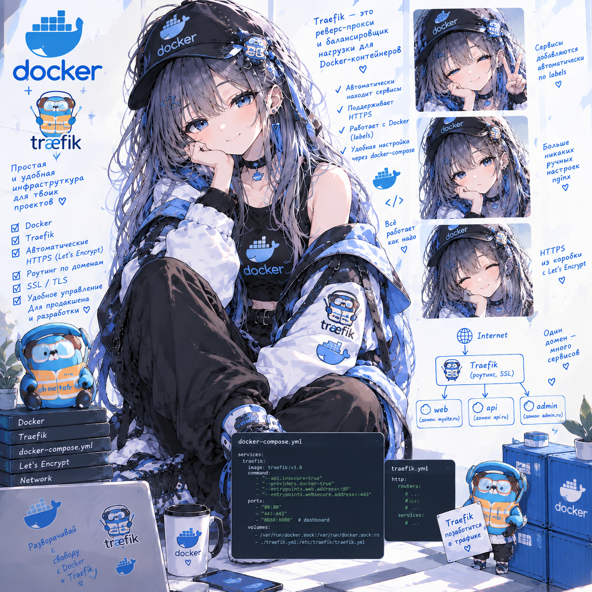

# Traefik Lab — reverse proxy, service discovery, TLS

**Статус: ⚪ методичка готова, прохождение впереди.**
**Сложность: низкая–средняя** (инфраструктурная, не про код — backend/frontend уже даны готовыми). Нужен Docker Compose на уровне «поднять сервис и почитать логи»; для новичков в контейнерах есть отдельный вводный раздел 0.

## О чём

Reverse proxy и service discovery для стека из нескольких сервисов — без ручной правки конфигов при каждом деплое, через Docker-labels.

## Стек

Traefik 3 + Docker Compose (с заметками про Podman) + Node.js API + статический frontend + PostgreSQL + Adminer.

## Формат

Методичка [`Docker_and_Traefik_Lab_Plan.html`](Docker_and_Traefik_Lab_Plan.html) — открывается в браузере. Есть отдельный раздел 0 "Введение в Docker с нуля" для тех, кто раньше не работал с контейнерами.

## Что внутри (3 сессии)

- **Сессия 1** — каталоги и `traefik/traefik.yml`; базовый `docker-compose.yml`; первый роутер через labels на тестовом сервисе `whoami`; dashboard Traefik и его защита; заметка про rootless Podman
- **Сессия 2** — backend API; frontend с path-routing (`StripPrefix`); PostgreSQL + Adminer за прокси; масштабирование API + healthcheck; цепочка middlewares
- **Сессия 3** — TLS через `mkcert` (локально) и Let's Encrypt (staging); canary-деплой (weighted round robin); "Production Hell" — финальный сценарий без подсказок

Модель для понимания: `EntryPoint → Router → Middleware → Service` — весь курс выстроен вокруг этой цепочки.

---

Часть сборного репозитория лабораторных работ — [submodule-group-lab](https://github.com/meeymirita/submodule-group-lab).
